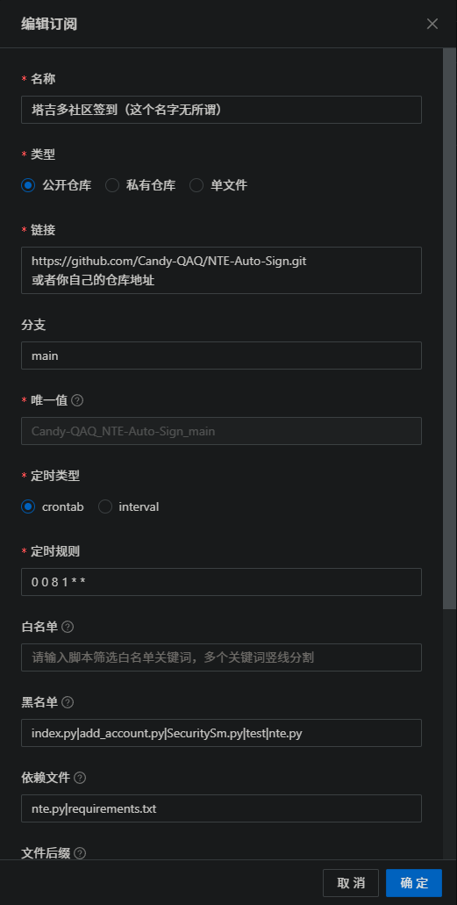
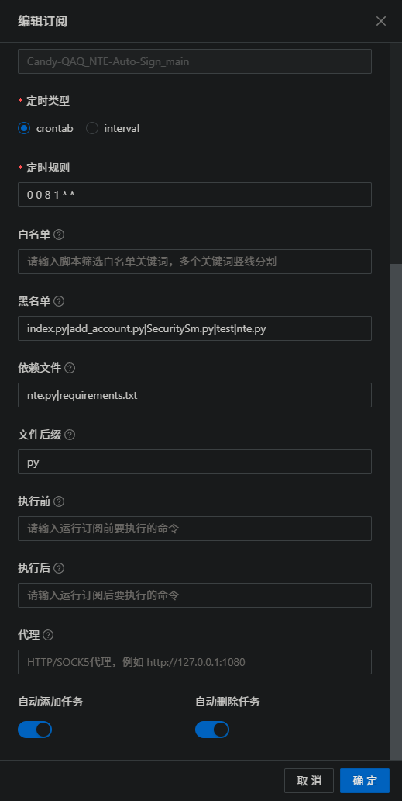

# NTE Auto Sign（塔吉多 / 异环）

NTE Auto Sign 是一个塔吉多（异环）自动签到工具，支持短信/refreshToken 登录、多账号管理与切换、社区+游戏签到、云异环每日时长领取、奖励日志输出，并提供 `nte.exe` 与 `add_account.exe` 便捷使用。

## 功能特性

- 手机号 + 短信验证码登录
- 手机号 + 密码登录
- `refreshToken` 登录（高级模式）
- 云异环手机号 + 短信验证码登录
- 多账号保存到 `TOKEN.txt`（每行一个账号）
- 运行时手动选择账号（单选 / 多选 / 全部）
- 社区签到 + 游戏签到
- 云异环每日首登时长领取与剩余时长查询
- 签到结果与奖励日志输出（`logs\YYYY-MM-DD.log`）

## 快速开始（Python）

1. 安装依赖

```bash
pip install -r requirements.txt
```

2. 添加账号（支持连续添加）

```bash
python add_account.py
```

3. 执行签到

```bash
python nte.py
```

## 账号文件（TOKEN.txt）

`TOKEN.txt` 每行一个账号，推荐使用 JSON：

```json
{
  "refreshToken": "xxx",
  "uid": "10xxxx",
  "deviceId": "xxxxx",
  "gameId": "1289",
  "roleIds": ["2160xxxxxxx"]
}
```

云异环账号可以只保存云时长领取所需字段：

```json
{
  "cloudToken": "xxx",
  "cloudUserId": "152xxxx",
  "cloudDeviceId": "xxxxx",
  "deviceId": "xxxxx"
}
```

同一个账号也可以同时保存塔吉多签到和云异环时长字段，运行时会自动执行两部分。

## 多账号运行

当 `TOKEN.txt` 中有多个账号时，`nte.py` / `nte.exe` 默认签到全部账号，适合双击运行。

如需手动选择账号，设置环境变量 `TGD_SELECT_ACCOUNTS=1` 后运行，会提示选择：

- `1`：只签到第 1 个账号
- `1,3`：签到第 1 和第 3 个账号
- 回车 / `all` / `a`：签到全部账号

## GitHub Actions 自动运行

本项目已提供 GitHub Actions 工作流，可每天自动执行签到，也可以手动运行。

1. 在 GitHub 仓库页面进入 `Settings` -> `Secrets and variables` -> `Actions`。
2. 新建仓库 Secret，名称填写 `NTE_TOKEN`。
3. 将账号内容填入 `NTE_TOKEN`，格式与本地 `TOKEN.txt` 相同；多账号时每行填写一个账号 JSON。
4. 推送代码后，进入 `Actions` -> `Auto Sign`，可以等待定时任务，也可以点击 `Run workflow` 手动运行。

默认定时任务为每天北京时间 08:00。工作流运行时会通过环境变量 `TOKEN` 读取 `NTE_TOKEN`，不会依赖仓库中的 `TOKEN.txt`。

## 青龙面板部署（Debian）

> 无需二次部署。青龙面板（Debian 容器）自带 Python3，接入本仓库后可自动拉取脚本并自动建立定时任务。

### 方式一：订阅拉取

1. **新建拉库任务**

   在「订阅管理」新建一条任务，复制下面命令，并在名称中粘贴：

   ```
   ql repo https://github.com/Candy-QAQ/NTE-Auto-Sign.git "" "index.py|add_account.py|SecuritySm.py|test|nte.py" "nte.py|requirements.txt" "main" "py"
   ```

   粘贴后按图补全，其余留空或按需填写。

   <p align="center">
     
   </p>
   <p align="center">
     
   </p>

   命令参数说明：

   - 白名单（第 2 个参数，`""`， 也就是无参数）：不过滤，拉取全部文件；
   - 黑名单（第 3 个参数）：排除`index.py`、`add_account.py`、`SecuritySm.py`、`test/`，以及 `nte.py`（`nte.py` 改由依赖方式拉取，避免重复建任务）；
   - 依赖（第 4 个参数）：`nte.py` 是签到核心（供入口 `import` 使用），`requirements.txt` 用于自动安装 `requests`、`cryptography`依赖；
   - 分支 `main`、后缀 `py`。

   > 使用 GitHub 仓库需要自行解决网络问题，地址前可加代理理前缀。

2. **确认自动建任务**

   拉库后，青龙会识别 `qinglong.py`，并根据其头部声明自动创建定时任务：

   _塔吉多（异环）自动签到 cron: 0 8 _ \* _ （每天 08:00）_

   签到时间由 [qinglong.py](qinglong.py) 头部 `cron: 0 8 * * *` 决定，需要改时间时直接改头部，或在面板里修改任务定时规则。

3. **配置账号**
   在「环境变量」中新增变量 `NTE_TOKEN`（仅支持此变量名），值与此值的格式与本项目中的 `TOKEN.txt` 相同，多账号时每一行一个账号 JSON。
4. **运行与结果**
   运行成功会输出类似下文的文本

   > 开始执行... 2026-08-19 00:57:53
   > 塔吉多（异环）自动签到
   > 使用环境变量里的账号信息...
   > 从环境变量中读取到 1 个账号...
   > 账号**\*\***：社区签到成功，获得 5 经验，金币 40
   > 角色 21****\*\*\*****签到成功：签到成功（gameId=\*\*\*\*），今日道具：x
   > 签到完成！
   >
   > 完成 ✅... 2026-08-19 00:57:55 耗时 2 秒

### 方式二：手动上传脚本

1. 将 `nte.py`、`qinglong.py` 上传到青龙脚本目录（`/ql/scripts/`）；
2. 安装依赖：`pip3 install requests cryptography`；若镜像找不到 `cryptography`，换源：`pip3 install cryptography -i https://mirrors.aliyun.com/pypi/simple/`；
3. 在「定时任务」新建任务，命令填 `python3 qinglong.py`，定时规则填 `0 0 8 * * *`；
4. 配置环境变量 `NTE_TOKEN`（同上）。

### 获取 token

在本地或服务器运行 `python add_account.py`，按提示登录（`1` 手机号+验证码 / `2` 手机号+密码），成功后把 `TOKEN.txt` 里的对应账号 JSON 复制到青龙的 `NTE_TOKEN`。账号格式参考上文「账号文件（TOKEN.txt）」。

## Windows EXE 使用

预编译文件位于 `dist\windows\`：

- `nte.exe`：签到主程序
- `add_account.exe`：账号添加工具

双击即可运行。

## 环境变量

| 变量                       | 说明                                    |
| -------------------------- | --------------------------------------- |
| `TOKEN`                    | 账号信息（支持多行，格式同`TOKEN.txt`） |
| `TGD_GAME_ID`              | 默认游戏 ID（默认`1289`）               |
| `TGD_ROLE_IDS`             | 角色 ID（逗号分隔，补充/覆盖自动拉取）  |
| `TGD_SIGN_GAME_IDS`        | 签到时尝试的 gameId 列表（逗号分隔）    |
| `TGD_SELECT_ACCOUNTS=1`    | 多账号时手动选择账号；默认签到全部      |
| `EXIT_WHEN_FAIL=on`        | 任一账号失败时，进程退出码为 1          |
| `NO_PAUSE=1`               | Windows 下失败时不等待回车              |
| `SKYLAND_TYPE=add_account` | 仅添加账号，不执行签到                  |

### 手动选择账号

默认情况下，`TOKEN.txt` 中有多个账号时会自动签到全部账号。只有需要手动选择账号时，才需要设置 `TGD_SELECT_ACCOUNTS=1`。

如果想双击运行并进入账号选择，可以新建 `手动选择签到.bat`：

```bat
@echo off
cd /d %~dp0
set TGD_SELECT_ACCOUNTS=1
nte.exe
pause
```

把这个 `.bat` 文件放在 exe 发布目录下，也就是和 `nte.exe`、`TOKEN.txt` 同一级。例如目录结构应类似：

```text
你的发布目录\
├─ nte.exe
├─ add_account.exe
├─ TOKEN.txt
└─ 手动选择签到.bat
```

## 常见问题

- `refreshToken 已失效`：删除 `TOKEN.txt` 后重新登录并添加账号。
- 云异环目前只支持手机号 + 短信验证码登录，添加账号时选择菜单 `4`。

## 致谢

本项目基于 skyland-auto-sign 修改：
https://gitee.com/FancyCabbage/skyland-auto-sign

## 演示图片

<p align="center">
  
</p>
<p align="center">
  
</p>
<p align="center">
  
</p>
